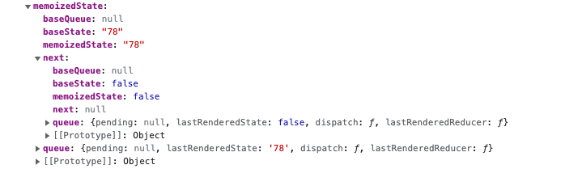

### hooks为什么不能用在判断中

因为hooks声明的变量是以链表的形式存储在memoizedState字段上，如果加了判断，
每次rerender时hooks的执行顺序不一定一致，就会导致从链表中的取值不能一一对应了。

```javascript
const Hello = () => {
  const [val, setVal] = React.useState()
  const [loading, setLoading] = React.useState(false)
}
```

